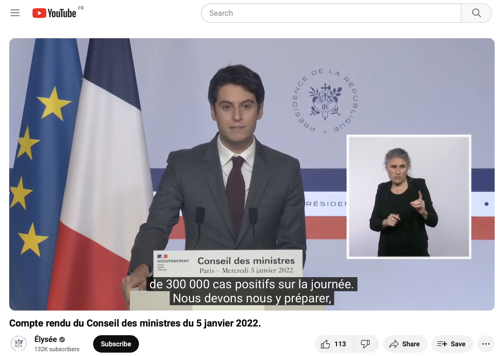

# Matignon-LSF: a Large Multimodal Corpus of Interpreted French Sign Language (LREC-Coling Workshop 2024)

This repository contains the tools that were used to build the corpus presented in **Matignon-LSF: a Large Multimodal Corpus of Interpreted French Sign Language**.

Matignon-LSF is the first dataset of interpreted French Sign Language (LSF) and one of the largest open LSF dataset to date. This is a dataset of live interpreted LSF during public speeches by the French government. The dataset comprises 39 hours of LSF videos with French language audio and
corresponding subtitles.  

In this repository, we share the diverse processes to enable reproduction and expansion of the corpus, as new press release takes place once a week.  
#### 1. Collecting the SL videos and subtitles
scripts in **collecting_datas**  

#### 2. Make I3D features
scripts in **I3D**  

#### 3. Processing the subtitles
scripts in **Preprocess subtitles**

#### 4. Make statistics

 <!-- 
 1. Scrap videos from Youtube Y
 2. Pre-process videos  Y  
 3. Make I3D features : https://github.com/JulieLascar/I3D  
 4. Align videos with subtitles and create dataset  on met un dossier ou autre lien github ??  
 5. Make statistics on vocabulary : faire un dossier vocabulary_stats avec lexicometry.py et un notebook stats ?
 6. Detect signer : signers_detection
 7. Informations sur les sous-titres (tailel voc etc).
 8. Changement dans les timestamps des sous-titres (pour atténuer le décalage signeur/sous-titrage ou pour desaligner Mediapi -> finetuning de l'algo d'alignement des sous-titres)
 9. Créations de nouveaux fichiers de sous-titres segmentés par phrases
-->
